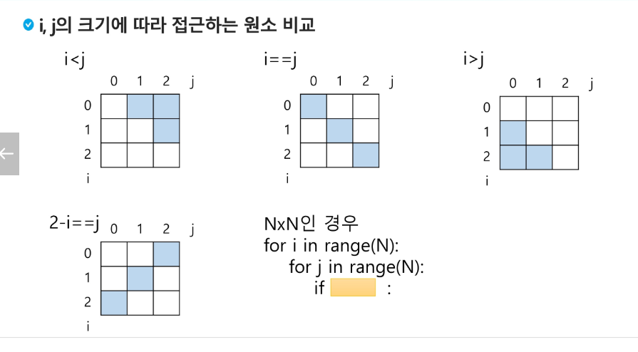

### 배열 2

#### 2차원 배열
- 1차원 List를 묶어놓은 List
- 2차원 이상의 다차원 List는 차원에 따라 Index를 선언
- 2차원 List의 선언 : 세로길이(행의 개수), 가로길이(열의 개수)를 필요로 함
- Python에서는 데이터 초기화를 통해 변수 선언과 초기화가 가능함

` arr = [[0,1,2,3],[4,5,6,7]] `
| 1 | 2 | 3 | 4 |
|---|---|---|---|
| 5 | 6 | 7 | 8 |

`arr = [[0]*3]*2` 이런식으로 배열을 선언할 시
arr[0][0] = 1 을 넣을 때 두 행의 모든 0번째 인덱스가 1로 바뀜

#### 배열 순회
- n X m 배열의 n*m 개의 모든 원소를 빠짐없이 조사하는 방법
#### 델타를 이용한 2차 배열 탐색
- 2차 배열의 한 좌표에서 4방향의 인접 배열 요소를 탐색하는 방법
- di[] = [0, 1, 0, -1]
- dj[] = [1, 0, -1, 0]
- 이럴때 모서리에 있을 경우 인덱스의 범위를 벗어남
- `if 0<=ni<N and 0 <= nj < N` # 유효한 인덱스면
  - f(arr[ni][nj])
- 즉 방법은 여러가지이지만 중요한 것은 범위 내의 인덱스인지 확인하는 과정이 필요함

#### 전치 행렬
- 3x3의 경우
- 

#### 부분집합
- 유한 개의 정수로 이루어진 집합이 있을 때, 이 집합의 부분집합 중에서 그 집합의 원소를 모두 더한 값이 0이 되는 경우가 있는지 알아내는 문제
- 예를 들어, [-7, -3, -2, 5, 8]라는 집합이 있을 때, [-3, -2, 5]는 이 집합의 부분집합이면서 (-3)+(-2)+5=0이므로 이 경우의 답은 참이 된다
- 완전검색 기법으로 부분집합 합 문제를 풀기 위해서는, 우선 집합의 모든 부분집합을 생성한 후에 각 부분집합의 합을 계산해야 한다.

## 검색
- 저장되어 있는 자료 중에서 원하는 항목을 찾는 작업
- 목적하는 탐색 키를 가진 항목을 찾는 것
  - 탐색 키(search key) : 자료를 구별하여 인식할 수 있는 키
- 검색의 종류
  - 순차 검색(sequential search)
  - 이진 검색(binary search)
  - 해쉬(hash)
#### 순차 검색
- 일렬로 되어있는 자료를 순서대로 검색하는 방법
- 가장 간단하고 직관적인 검색 방법
- 배열이나 연결 리스트 등 순차구조로 구현된 자료구조에서 원하는 항목을 찾을 때 유용함
- 알고리즘이 단순하여 구현이 쉽지만, 검색 대상의 수가 많은 경우 수행시간이 급격히 증가하여 비효율적
- 정렬되어있거나 안되어있거나 두가지 경우에 대해서 생각함
- 시간 복잡도 : O(n)
##### 정렬되어 있지 않을 경우
- 첫 번째 원소부터 순서대로 검색 대상과 키 값이 같은 원소가 있는지 비교
- 키 값이 동일한 원소를 찾으면 그 원소의 인덱스 반환
- 자료구조의 마지막까지 검색 대상 못찾으면 검색 실패
##### 정렬되어 있는 경우
- 자료가 오름차순으로 정렬된 상태에서 검색을 실행한다고 가정
- 자료를 순차적으로 검색하면서 키 값을 비교하여, 원소의 키 값이 검색 대상의 키 값보다 크면 찾는 원소가 없다는 것이므로 더이상 검색 X
#### 이진 검색
- 자료의 가운데에 있는 항목의 키 값과 비교하여 다음 검색의 위치를 결정하고 검색을 계속 진행하는 방법
  - 목적 키를 찾을 때까지 이진 검색을 순환적으로 반복 수행함으로써 검색 범위를 반으로 줄여가면서 보다 빠르게 검색 수행
- 이진 검색을 하기 위해서는 자료가 정렬된 상태여야함
- 검색 범위의 시작점과 종료점을 이용하여 검색을 반복 수행
- 이진 검색의 경우, 자료에 삽입이나 삭제가 발생했을 때 배열의 상태를 항상 정렬 상태로 유지하는 추가 작업 필요
#### 인덱스
- 인덱스는 Database에서 유래했으며, 테이블에 대한 동작 속도를 높여주는 자료 구조를 말함
- Look up table 등의 용어를 사용하기도 함
- 인덱스를 저장하는데 필요한 디스크 공간은 보통 테이블을 저장하는데 필요한 디스크 공간보다 적다. 이유는 보통 인덱스는 키-필드만 가지고 있고, 테이블의 다른 세부 항목을 가지지 않기 때문이다

## 정렬
#### 선택 정렬
- 주어진 자료들 중 가장 작은 값의 원소부터 차례대로 선택하여 위치를 교환함
- 주어진 리스트 중 최소값을 찾음
- 그 값을 리스트의 가장 앞에 위치한 값과 교환
- 처음 위치를 제외한 나머지 리스트를 대상으로 반벅
- 시간 복잡도 : O(n**2)
### 셀렉션 알고리즘
- 저장되어 있는 자료로부터 k번째로 큰 혹은 작은 원소를 찾는 방법을 셀렉션 알고리즘이라고 한다
  - 최소값, 최대값 혹은 중간값을 찾는 알고리즘을 의미하기도 한다
- 셀렉션은 정렬 알고리즘을 이용해 자료를 정렬하고 원하는 순서에 있는 원소를 가져온다