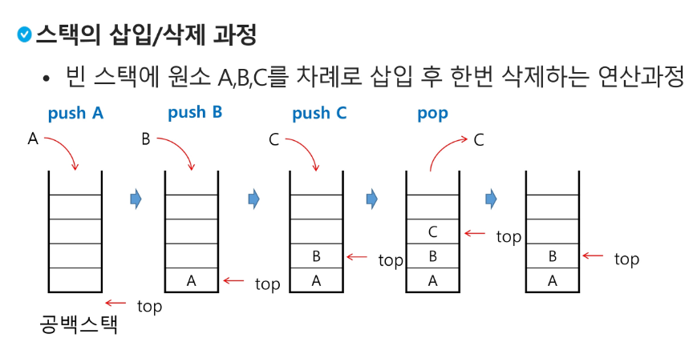

## 스택
#### 스택
- 물건을 쌓아 올리듯 자료를 쌓아 올린 형태의 자료구조
- 스택에 저장된 자료는 선형 구조를 갖음
  - 선형구조 : 자료 간의 관계가 1대1의 관계를 가짐
  - 비선형구조 : 자료 간의 관계가 1대N의 관계를 가짐(트리)
- 스택에 자료를 삽입하거나 스택에서 자료를 꺼낼 수 있다.
- 마지막에 삽입한 자료를 가장 먼저 꺼내는 후입선출(LIFO)라고 부른다
- 스택에 1, 2, 3 순으로 자료를 삽입하면 3, 2, 1 순으로 꺼낸다
- 자료구조 : 자료를 선형으로 저장할 저장소
- 배열 사용
- 스택 마지막 삽입위치를 top이라 부름
#### 스택 연산
- 삽입 : 저장소에 자료를 저장(push)
- 삭제 : 저장소에서 자료를 꺼냄(pop)
- 공백 확인 : 저장소가 공백인지 확인(isEmpty)
- top 원소 반환 : 스택의 top에 있는 item(원소)를 반환(peek)
#### 스택의 삽입/삭제 과정

#### 스택 구현 고려 사항
- 1차원 배열을 사용하여 구현할 경우 구현이 용이하지만 스택 크기 변경이 어려움
- 저장소를 동적으로 할당해 스택을 구현, 동적 연결리스트를 이용해 구현하는 방법
- 구현이 복잡하지만 메모리를 효율적으로 사용한다
#### 재귀호출
- 필요한 함수가 자신과 같은 경우 자신을 다시 호출하는 구조
- 함수에서 실행해야 하는 작업의 특성에 따라 일반적인 호출방식보다 재귀호출방식을 사용하여 함수를 만들면 프로그램의 크기를 줄이고 간단하게 작성
#### DP(동적계획법)
- DP 알고리즘은 그리디 알고리즘과 같이 최적화 문제를 해결하는 알고리즘
- 피보나치 수는 부분 문제의 답으로부터 본 문제의 답을 얻을 수 있으므로 최적 부분 구조로 이루어져 있다.
- 부분 문제로 나눈 뒤 가장 작은 부분 문제부터 해를 구한다
- 그 결과를 테이블에 저장하고, 테이블에 저장된 부분 문제의 해를 이용해 상위 문제의 해를 구한다
#### DFS(깊이우선탐색)
- 비션형구조인 그래프 구조는 그래프로 표현된 모든 자료를 검색하는 것이 중요
- 시작 정점의 한 방향으로 갈 수 있는 최대 깊이까지 탐색하고, 더이상 못 갈 경우 마지막에 만난 갈림길에서 다른 방향으로 최대 깊이까지 탐색하는 방법으로 모든 정점을 방문하는 순회 방법
- 가장 마지막에 만났던 갈림길의 정점으로 되돌아가서 다시 깊이 우선 탐색을 반복해야 하므로 후입선출 구조의 스택 사용(재귀 가능)
#### 계산기
- 중위 표기법에서 후위 표기법으로 변환한다 
#### 백트래킹
- 백트래킹 기법은 해를 찾는 도중에 '막히면(즉, 해가 아니면) 다시 돌아가서 해를 찾는 법
- 백트래킹 기법은 최적화(optimization) 문제와 결정(decision) 문제를 해결할 수 있다
##### DFS와 차이점
- 어떤 노드에서 출발하는 경로가 해결책으로 이어질 것 같지 않으면 더 이상 그 경로를 따라가지 않음으로써 시도의 횟수를 줄임
- 깊이우선탐색이 모든 경로를 추적하는데 백트래킹은 불필요한 경로 차단
- 깊이우선탐색을 가하기에는 경우의 수가 너무 많아 가지의 경우의 수를 가진 문제를 DFS로 풀면 처리 불가능
- 백트래킹 또한 최악의 경우 전부 탐색해야하는 경우가 있기 때문에 처리 불가능
#### 백트래킹 기법
- 어떤 노드의 유망성을 점검하고 가능성이 없다면 부모 노드로 돌아가 다음 자식 노드로 감
- 어떤 노드를 방문했을 때 그 노드를 포함한 경로가 해답이 안될 경우 유망하지 않다고 함
- 가지치기(pruning) 유망하지 않는 노드가 포함되는 경로는 더이상 고려 X
