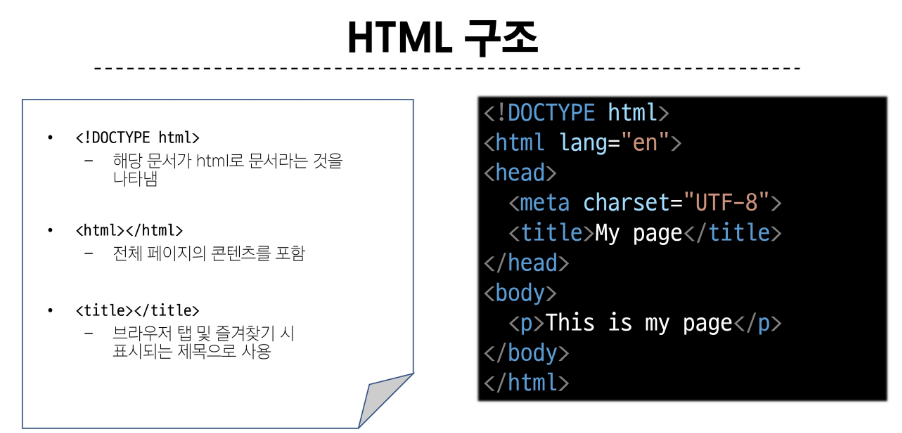
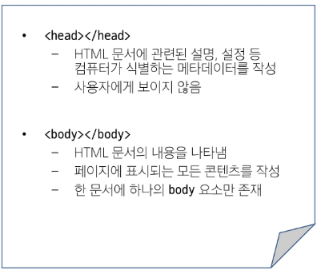

### web
- web site, web application 등을 통해 사용자들이 정보를 검색하고 상호 작용하는 기술
- HTML
  - structure
  - HyperText Markup Language
  - 웹 페이지의 의미와 구조를 정의하는 언어
- CSS
  - styling
- 자바스크립트
  - behavior
#### Hypertext
- 웹 페이지를 다른 페이지로 연결하는 링크
- 비선형성 / 상호연결성 / 사용자 주도적 탐색
#### Markup language
- 태그 등을 이용하여 문서나 데이터의 구조를 명시하는 언어
- 마크업을 한다 -> 구조를 만든다
#### HTML 구조
- 
- 
- 알트+B

#### CSS box model
- 웹 페이지의 모든 HTML 요소를 감싸는 사각형 상자 모델
- 내용, 안쪽 여백, 테두리, 외부 간격으로 구성되어 요소의 크기와 배치를 결정
- 박스 표시 타입
  - Outer display type
  - Inner display type

#### 박스 구성요소
- content box
  - 실제 콘텐츠가 표시되는 영역 크기
  - width 및 height 속성을 사용하여 크기 조정
- padding box
  - 콘텐츠 주위에 공백
  - padding 관련 속성을 사용하여 크기 조정
- border box
  - 콘텐츠와 패딩을 래핑
  - border 관련 속성을 사용해 크기 조정
- margin box
  - 콘텐츠, 패딩 및 테두리 래핑
  - 박스와 다른 요소 사이의 공백
  - margin 관련 속성 사용해 크기 조정

#### shorthand 속성
- border
  - border-width, border-style, border-color 마음대로 저장
- margin & padding
- 4개 - 상우하좌
- 3개 - 상/좌우/하
- 2개 - 상하/좌우
- 1개 - 공통

#### inline-box
- inline과 block요소 사이의 중간 지점을 제공하는 display 값
- width 및 height 속성 사용 가능
- padding, margin 및 border로 인해 다른 요소가 상자에서 밀려남
- 새로운 행으로 넘어가지 않음

#### CSS layout
- 각 요소의 위치와 크기를 조정하여 웹 페이지의 디자인을 결정하는 것
- display, position, flexbox
- CSS position
  - 요소를 normal flow에서 제거하여 다른 위치로 배치하는 것
#### position
- 목적
  - 전체 페이지에 대한 레이아웃을 구성하는 것보다는 페이지 특정 항목의 위치를 조정하는 것
- static
  - 요소를 normal flow에 따라 배치
  - top, right, bottom, left 속성이 적용되지 않음
  - 기본값
- relative
  - 요소를 normal flow에 따라 배치
  - 자신의 원래 위치를 기준으로 이동
  - top, right, bottom, left 속성으로 위치 조정
  - 다른 요소의 레이아웃에 영향을 주지 않음
- absolute
  - 
- fixed
  - 요소를 normal flow에서 제거
  - 현재 화면영역을 기준으로 이동
  - 스크롤해도 항상 같은 위치에 유지됨
  - top, right, bottom, left 속성으로 위치를 조정
  - 문서에서 요소가 차지하는 공간이 없어짐
- sticky
  - relative 와 fixed가 합쳐짐
#### z-index 특징
- 기본값은 auto
- 부모 요소의 z-index 값에 영향 받음
- 같은 부모 내에서만 z-index 값을 비교
- 부모의 z-index가 낮으면 자식의 z-index가 아무리 높아도 부모보다 높게 못감
- 같을 경우 나중에 작성된 코드가 위로 올라감
#### CSS Flexbox
- 요소를 행과 열 형태로 배치하는 1차원 레이아웃 방식

flexbox 슉성 목록
- flex container 관련 속성
- flex item 관련 속성
- flex item은 기본적으로 행으로 나열
- flex-direction
  - flex item이 나열되는 방향 정리
  - flex item 목룍이 flex contaioner에
  - flex-wrap
  - justify-content
    - 주 축을 따라 flex item과 주위에 공간을 분배
  - align-content
- justify, content 차이
- 
- 